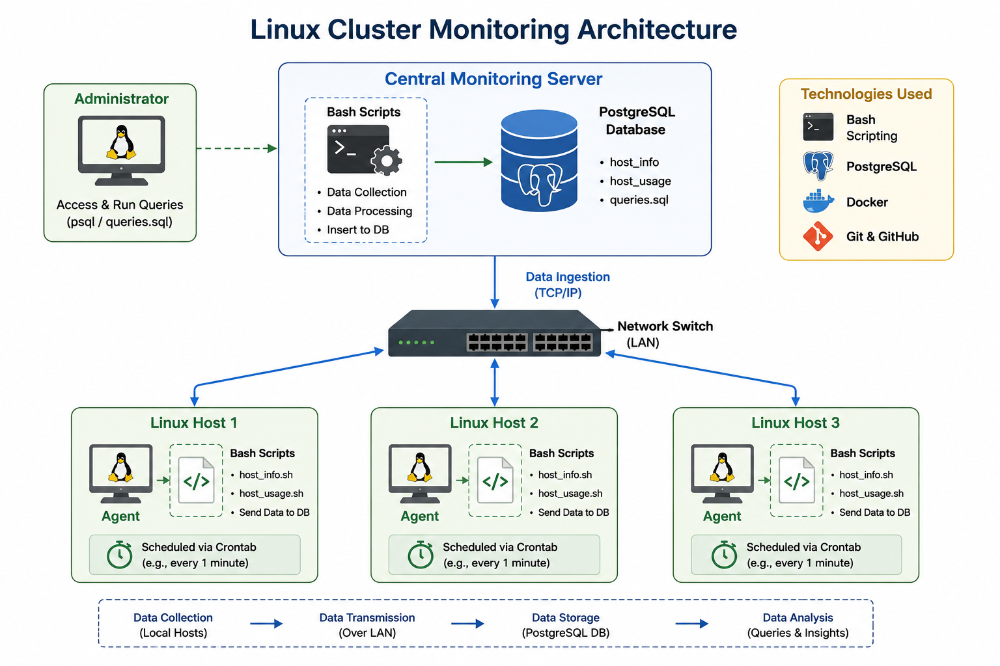

# Linux Cluster Monitoring Agent

## Introduction

The Linux Cluster Administration team monitors the usage of a linux cluster of 10 nodes. The goal of this project is to collect the hardware inforamtion and the server usage (like CPU, memory, etc) so that it would help the infrastructure team with resource planning. i.e. adding/ removing servers accordingly. This project implements a MVP using just a single node, although it is designed to scale to as many nodes as required. For version control, git is used. The scripts are written in bash or psql (for DDL and DML) as the usage and hardware information are sent to a postgres database which is provisioned by docker using containerization. The hardware bash script is only run once, while the usage info is collected every minute using crontab.

---

# Quick Start

## 1. Start PostgreSQL Container

```bash
./scripts/psql_docker.sh start
```

## 2. Create Database Tables

```bash
psql -h localhost -U postgres -d host_agent -f sql/ddl.sql
```

## 3. Insert Hardware Information

```bash
./scripts/host_info.sh localhost 5432 host_agent postgres password
```

## 4. Insert Hardware Usage Data

```bash
./scripts/host_usage.sh localhost 5432 host_agent postgres password
```

## 5. Setup Crontab

Open crontab editor:

```bash
crontab -e
```

Add the following line to collect usage data every minute:

```bash
* * * * * bash ./scripts/host_usage.sh localhost 5432 host_agent postgres password
```

---

# Implementation

## Architecture

The monitoring system uses a centralized database architecture. Each Linux host runs monitoring agents that collect system information and usage statistics. The agents communicate with a PostgreSQL instance running inside a Docker container.

### System Components

- Linux Hosts
- Monitoring Agent
- PostgreSQL Database
- Docker Container
- Crontab Scheduler



---

## Scripts

### `psql_docker.sh`

This script automates the creation, startup, and management of a PostgreSQL Docker container.

#### Usage

```bash
./scripts/psql_docker.sh start|stop|create [db_username][db_password]
```

---

### `host_info.sh`

This script collects static hardware information such as CPU details, memory size, hostname, and Linux kernel version, then inserts the data into the database.

#### Usage

```bash
./scripts/host_info.sh psql_host psql_port db_name psql_user psql_password
```

---

### `host_usage.sh`

This script gathers dynamic system usage metrics including CPU utilization, memory availability, disk usage, and running processes.

#### Usage

```bash
./scripts/host_usage.sh psql_host psql_port db_name psql_user psql_password
```

---

### `crontab`

Crontab is used to automate the execution of the monitoring script every minute to ensure continuous metric collection.

#### Example

```bash
* * * * * bash ./scripts/host_usage.sh localhost 5432 host_agent postgres password
```

---

### `ddl.sql`

This file contains analytical SQL queries used to solve operational monitoring problems and generate insights from collected server metrics.

#### Business Problems Solved

- Identify servers with high CPU utilization
- Detect low memory availability
- Monitor storage consumption trends
- Analyze system activity across hosts
- Track infrastructure resource usage over time

---

## Database Modeling

### `host_info`

| Column Name | Description |
|---|---|
| id | Unique identifier for each host |
| hostname | Linux machine hostname |
| cpu_number | Number of CPU cores |
| cpu_architecture | CPU architecture type |
| cpu_model | Processor model name |
| cpu_mhz | CPU clock speed |
| l2_cache | L2 cache size |
| total_mem | Total system memory |
| timestamp | Record creation timestamp |

---

### `host_usage`

| Column Name | Description |
|---|---|
| timestamp | Time when usage data was collected |
| host_id | Reference to host_info table |
| memory_free | Available memory |
| cpu_idle | CPU idle percentage |
| cpu_kernel | Kernel usage percentage |
| disk_io | Number of disk I/O operations |
| disk_available | Available disk space |

---

# Test

The Bash scripts and SQL files were tested individually and as part of the complete monitoring workflow. Each script was executed with valid and invalid parameters to verify error handling and database connectivity.

Database tables were validated using PostgreSQL queries to ensure records were inserted correctly. Docker container status and PostgreSQL connections were also tested to confirm successful deployment. Crontab execution was verified by checking periodic database updates and reviewing generated log files.

The final result was a fully automated monitoring system capable of collecting and storing Linux server metrics continuously without manual intervention.

---

# Deployment

The application was deployed using Docker and GitHub. PostgreSQL was containerized using Docker to simplify environment setup and improve portability. Source code was managed and version-controlled through Git and GitHub repositories.

Monitoring scripts were scheduled using Linux Crontab to automate recurring metric collection. The deployment process allows the monitoring system to run consistently across Linux environments with minimal configuration.

---

# Improvements

- Add automatic alerts for abnormal CPU or memory usage
- Support monitoring for additional operating systems
- Improve error logging and monitoring reliability
- Add data visualization dashboards using Grafana or Power BI
- Implement container health checks and recovery mechanisms
- Secure database credentials using environment variables


