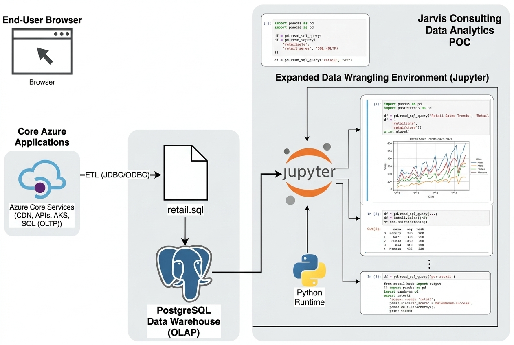

# London Gift Shop (LGS) - Retail Data Analytics PoC

## Introduction and Design

### Business Context

London Gift Shop (LGS) is a UK-based online retail store specializing in giftware products. A significant portion of its customer base consists of wholesalers. Although the company has been operating online for over a decade, its revenue has remained stagnant in recent years.

To address this challenge, the LGS marketing team aims to leverage modern data analytics to better understand customer behavior and improve sales and marketing strategies. However, due to limited internal IT and engineering resources, LGS engaged Jarvis Consulting to deliver a Proof of Concept (PoC) data analytics solution.

### Business Objective

The primary objective of this PoC is to analyze customer purchasing behavior and generate actionable insights that the marketing team can use to:

* Design targeted marketing campaigns (email, events, promotions)
* Improve customer retention and reactivation strategies
* Acquire new high-value customers
* Increase overall revenue through data-driven decision-making

### Role of Data Engineering & Analytics

As part of Jarvis Consulting, the data engineering and analytics team is responsible for processing transaction data and performing exploratory and advanced analytics using Python-based tools. The final outputs are delivered in a Jupyter Notebook format for business consumption.

---

## Implementation

The PoC is implemented using a lightweight analytics stack focused on Python-based data analysis tools. The technologies used include:

* Python
* Jupyter Notebook
* Pandas
* NumPy

The workflow consists of data cleaning, transformation, exploratory analysis, and customer segmentation to answer key business questions around customer behavior and revenue generation.

---

## Online Store Cloud Architecture

The LGS system follows a hybrid cloud-based architecture. Since this project is a Proof of Concept, the Jarvis team does not have direct access to the production Azure environment. Instead, a sanitized dataset extracted from the operational system is provided for analysis.

The architecture consists of the following components:

* Front-end web application hosted via CDN and Azure Blob Storage
* API layer managed through Azure API Management
* Backend microservices running on Azure Kubernetes Service (AKS)
* Transactional data stored in Azure SQL Database (OLTP)
* ETL pipeline exporting data to a PostgreSQL Data Warehouse (OLAP)
* Data analytics performed using Jupyter Notebook

### Architecture Diagram

---

## Data Set Information

The dataset used for this analysis is derived from `retail.sql`, containing transactional retail data from **December 1, 2009 to December 9, 2011**.

### Key Attributes

| Column         | Description                                                       |
| -------------- | ----------------------------------------------------------------- |
| `invoice_no`   | Unique transaction identifier (prefix `C` indicates cancellation) |
| `stock_code`   | Product identifier                                                |
| `description`  | Product name                                                      |
| `quantity`     | Number of items purchased                                         |
| `invoice_date` | Transaction timestamp                                             |
| `unit_price`   | Price per unit (GBP)                                              |
| `customer_id`  | Unique customer identifier                                        |
| `country`      | Customer location                                                 |

---

## Data Analytics and Wrangling

All data preprocessing, analysis, and visualization are performed within the Jupyter Notebook:

📓 **Notebook:** [retail_data_analytics_wrangling.ipynb](./retail_data_analytics_wrangling.ipynb)

### Key Analytical Focus Areas

* Data cleaning and validation

  * Handling cancelled transactions
  * Missing value treatment
  * Removal of invalid records
* Customer segmentation using RFM Analysis
* Monthly sales growth analysis
* Monthly Active Users (MAU)
* New vs. Returning Customer analysis

### Business Impact

The insights generated from this analysis help LGS:

* Identify high-value and at-risk customer segments
* Optimize marketing campaigns using customer segmentation
* Improve retention through targeted engagement initiatives
* 
---

## Testing

No automated testing framework is required for this Proof of Concept. Validation is performed through:

* Exploratory Data Analysis (EDA)
* Data quality checks
* Manual verification of analytical outputs

---

## Deployment

The solution is designed for local execution using:

* Jupyter Notebook
* Python 3.x
* Optional Docker environment for reproducibility

### Deliverables

* Jupyter Notebook containing the complete analysis workflow
* GitHub repository with source code and documentation
* Customer segmentation and RFM insights for the LGS marketing team

---

## Future Improvements

Given additional time and resources, the following enhancements could be implemented:

### 1. Predictive Customer Churn Modeling

Develop machine learning models to identify customers at risk of churning and proactively target them with retention campaigns.

### 2. Customer Lifetime Value (CLV) Analysis

Estimate long-term customer value to optimize marketing spend and prioritize profitable customer segments.

### 3. Interactive Business Dashboard

Develop an interactive dashboard using Power BI or Tableau to enable business users to explore:

* Revenue trends
* Customer segments
* Marketing performance
* Key business KPIs

in real time.

---

## Technologies Used

* Python
* Pandas
* NumPy
* Jupyter Notebook
* PostgreSQL
* Docker
